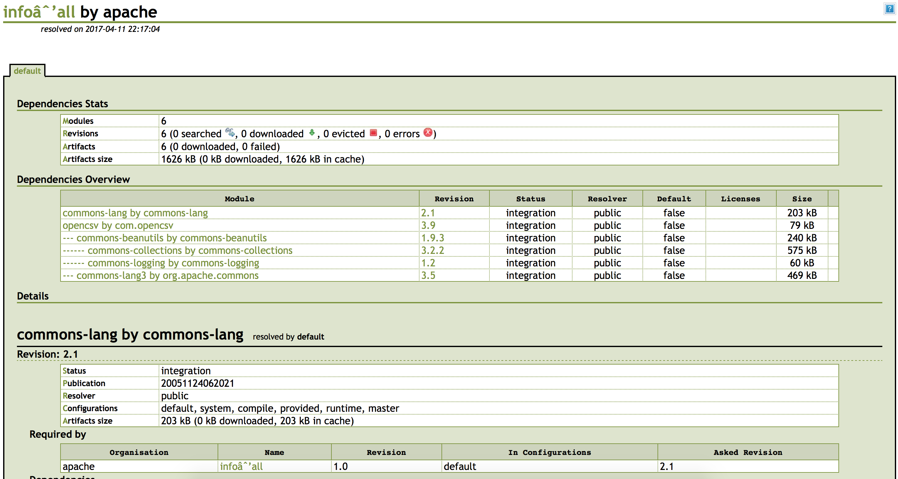

# TD-Ant 

Par Quentin Laplanche 

- ## Exercice 4
    * le programme affiche hello World, puis ce meme texte avec la première lettre en capitale.

- ## Exercice 6 
    * Le Tag javac est a pour but de compiler le projet.
    * Le Tag java a lui pour but de l'éxécuter

- ## Exercice 7 

```xml
    <target name="run" depends="go" description="--> run the project">
        <java classname="example.Hello">
            <classpath>
                <path refid="lib.path.id" />
                <path location="${build.dir}" />
            </classpath>
        </java>
    </target>
```

- ## Exercice 8 

`[echo] Dans le Classpath : /Users/quentin/.ivy2/cache/commons-lang/commons-lang/jars/commons-lang-2.1.jar`


- ## Exercice 9 

    - Erreur dans les sources car la référence vers lib.path.id n'éxiste pas.
    - `ivy:cachepath` défini le chemin vers le cache de ivy, c'est à partir de ce path qu'est créée le dossier lib.`

- ## Exercice 11 

    - Ant a téléchargé 6 artifacts.

```
------------------
||   artifacts   |
|| number|dwnlded|
------------------
||   6   |   0   |
------------------
```

# OpenCSV

- ## Exercice 15 
```
run:
     [java] standard message : hello ivy !
     [java] capitalized by org.apache.commons.lang.WordUtils : Hello Ivy !
     [java] Nombre lu : 4
     [java] Nombre lu : 3
     [java] Nombre lu : 8
     [java] Nombre lu : 5
     [java] Nombre lu :a 6
     [java] Max : 8
```


# Documentation

- ## Exercice 17
    - Dans le répertoire report on obtient 3 fichiers, dont un fichier html et un fichier css,
qui nous apporte toutes les informations sur les dépendences collectés par ant et ivy, pour le programme hello-ivy

- ## Exercice 19



